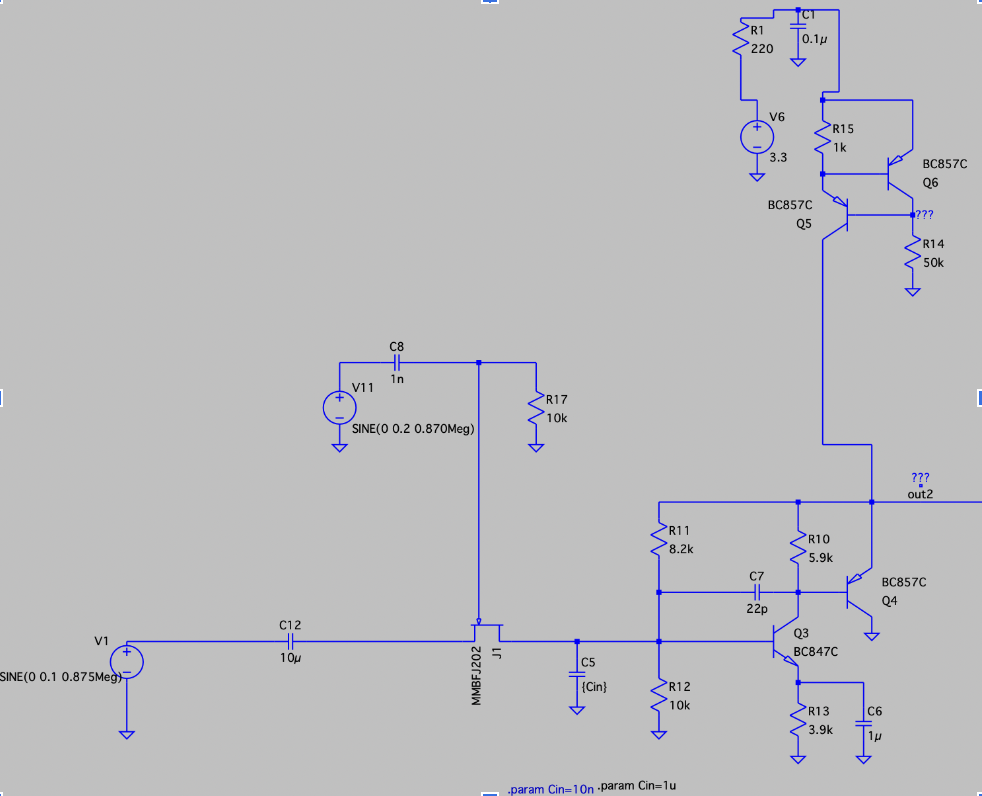
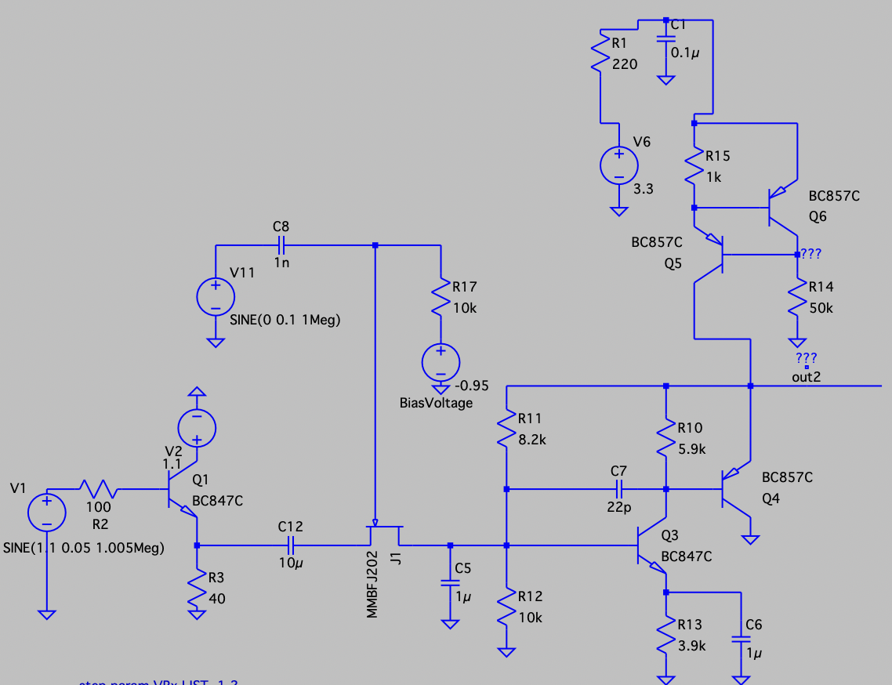
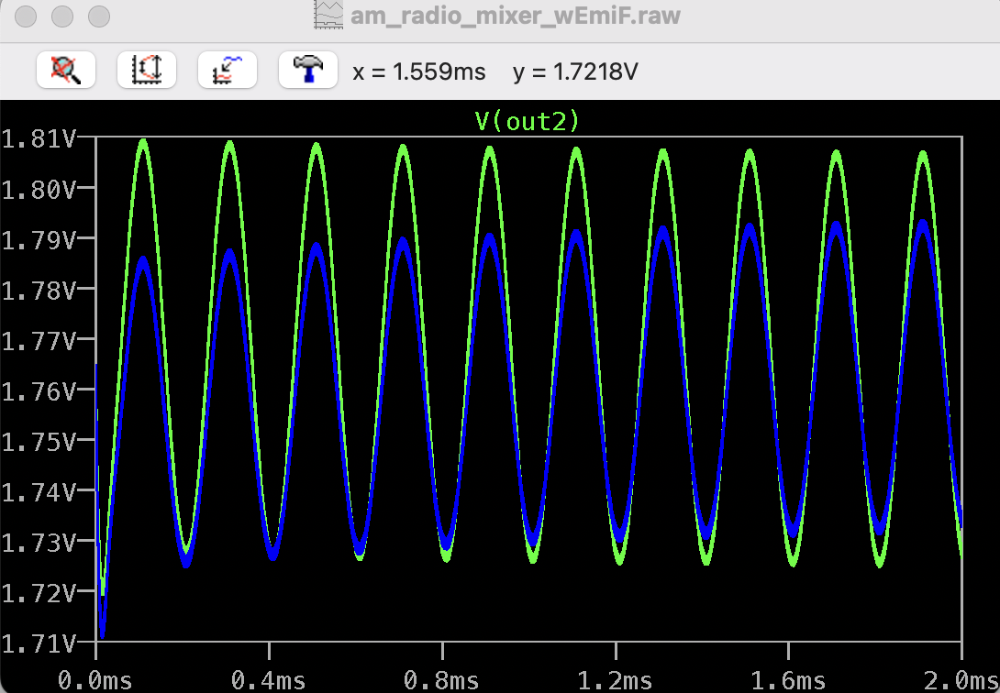
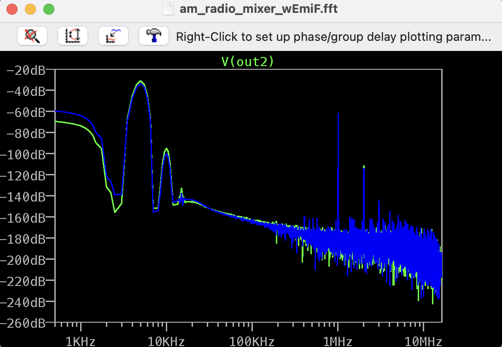
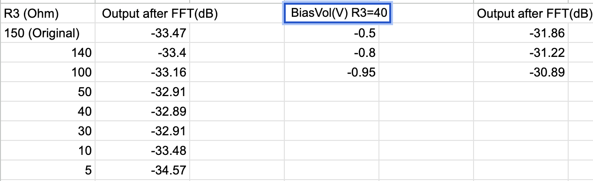

# Hardware report

## Active Antenna

The following figure illustrates the schematic active antenna circuit, powered up by a 3.3V DC source. The circuit consists of two stages. The first stage utilizes a BF256B JFET emitter follower with a voltage divider at the base to regulate the voltage at Output1 and prevent the JFET from saturating. The second stage of the circuit is a PN2222A BJT emitter follower to achieve a low output impedance. Since the spectrum analyzer only has a low input impedance of 50 ohms, a large output impedance is added between the circuit and spectrum analyzer during signal analysis to prevent damage to the spectrum analyzer.

As the bode plot of the output shown, the active antenna circuit will not amplify any signals. Instead, it will allow the signal in the range of 1kHz to 2MHz to pass through and attenuate the rest signals. This circuit is particularly useful for AM radio which covers frequencies ranging from 500kHz to 1.8MHz. 

The following figure displays the prototype of the active antenna on a breadboard. By replacing the input with a 15 feet 28 gauge wire, the active antenna is able to collect the surrounding AM signals. Fig4 shows the output of the active antenna on the spectrum analyzer, revealing the presence of AM radio signals in the Boston University Photonics Center Room 113. The room contains multiple AM radios, as indicated by the distinct peaks on the graph, notably at 850kHz, 1.03MHz, 1.32MHz, and 1.55MHz. The graph serves as evidence that the AM radio signals are capable of penetrating through the walls and being collected by the active antenna.

## Isolation Amplifier

The goal of this section is to improve the original version of the isolation amplifier, the areas we focused on were the gain, input noise, and input impedance of the isolation amplifier. The gain is the relationship between the input voltage and the output voltage of the signal, we measured in dB within our analysis. The performance of an isolation amplifier heavily depends on the noise, the noise is an unwanted signal that creates disturbance for signal processing. The input impedance of the isolation amplifier must be high.

### Original Isolation Amplifier
The isolation amplifier in the following figure, which is the first step in this signal processing chain, enhances the signal from the active antenna by a factor of 10, reducing the adverse effects of the following circuits as such. The isolation amplifier's gain should be precise and consistent across time, and the amplifier's bandwidth needs to be sufficient to accommodate the signal being measured frequency range, also the amplifier improves the signal-to-noise ratio of the AM localization system and prevents these disturbances from interfering with with with other systems which utilize the active antenna.

### Improved Isolation Amplifier
The Figure below shows the prototype and schematic of the improved isolation amplifier, the improved isolation amplfiier will have higher gain, lower input voltage noise, and higher input impedance. 

## Tracking Filter

In the following figure is the original tracking filter. It describes a Q-enhanced filter with one amplification stage and two follower stages. Capacitor C4 is meant to be replaced by varactors in parallel in order to have a voltage-controlled variable capacitance. The main improvement objective for the circuit is to find an appropriate feedback resistance for which we can have a constant gain with stable Q along the desired frequency range. Although the simulations show an ideal gain and Q  along the entire frequency range, the breadboard prototype will become unstable around the 8MHz mark. In order to validate the results of the simulation we built a breadboard prototype and connected it to a signal generator in order to test its response at different frequencies. We get a significantly better performance from the simulation with the prototype which when centered at approximately 912kHz in which we observe a 3dB decrease in power when the signal differs for 2kHz which means a 4kHz bandwidth. The fix for the stability problem on the real prototype gives us an opportunity for improvement by making the change in Q an easier parameter to manipulate.

## Improved Tracking Filter

The following figures shows the prototype and the schematic of the improved tracking filter. In order to ease the change of the Q parameter by the end user we make use of the IV characteristics of JFETs. By setting the JFET into its ohmic region we achieve what essentially is a voltage controlled resistor. We achieve this ‘biasing’ current to sustain resistive behavior by changing the value of resistor R10. In order to control the resistance of the JFET we must add a control unit which will deliver a voltage control. For theory (and simulation) we could just deliver enough control voltage to turn on the JFET and thus create a filter with an almost ideal Q. If we do this and only deliver a 0.7V control we can obtain an amplification of 50dB with a bandwidth of 1kHz for a 1MHz target signal, greatly outperforming the original design. A further improvement that simplifies the usage of the filter (although limiting the control of the end user upon its capabilities) is to set hard limits to the minimum and maximum feedback resistance in order to guarantee a more stable response of the filter. We achieve this by setting a minimum resistance in series with the JFET and a maximum resistance in parallel. 

## Triode Mixer

The triode mixer comes after the tracking filter, works as a essential part of AM radio localization system. Using a mixer, the circuit generates intermediate frequency (IF) signals by multiplying a radio frequency (RF) signal with a local oscillator (LO) signal. It receives inputs from the isolation amplifier (RF) and a signal generated locally (LO). In this circuit, for instance, the mixer produces two new frequencies: RF-LO and RF+LO, which are separated by a constant 5 kHz offset. These new frequencies generate 5kHz IF signals and another signal with a high IF frequency. With a low-pass filter, the high frequency IF signal can be readily eliminated, leaving only the 5kHz IF signal. The mixer also retains the phase, allowing for extremely precise phase measurements of high-frequency signals. The circuit schematic is shown below:

In validation of original circuit on breadboard, the experimental parameters and results for the breadboard validation of the triode mixer circuit are detailed below. The input signals are produced by two function generators that simulate RF and LO signals. The first function generator produces a sine wave with a frequency of 1.05 MHz, an amplitude of 0.1 V, and no offset voltage. The second outputs a 1 MHz sine wave with the same amplitude and offset as the first. An oscilloscope's output displays a 5 kHz wave in time domain and an amplitude peak at 5 kHz after FFT.

After improved the circuit, the mixer's conversion gain, which measures how much the output signal amplitude is increased or decreased relative to the inputs, has been significantly enhanced. We primarily concentrate on two factors: increasing the input signal strength from the local oscillator with an emitter follower and determining the optimal bias current with the Rb resistor. The second step is to optimize the gate-drain bias voltage of JFET J1 to enhance conversion gain. The bias voltage is controlled by the BiasVol DC voltage source. In the enhanced triode mixer, R3 is decreased to 40 ohms to maximize the power input from the VCO, and BiasVol is adjusted to -0.95 volts to increase the gate-drain bias voltage to approximately -1.9 volts. In time domain simulation, the enhanced output has an amplitude that is 0.025 V greater than its original output, which represents a 40% improvement. At the desired 5 kHz frequency output, the enhanced version is approximately 2dB larger than the original after FFT. As depicted in following graphs, the original output is shown in blue while the enhanced output is shown in green.

