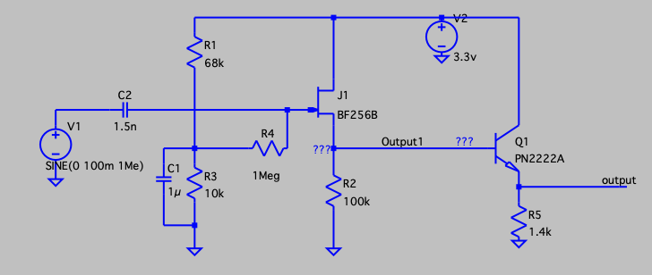
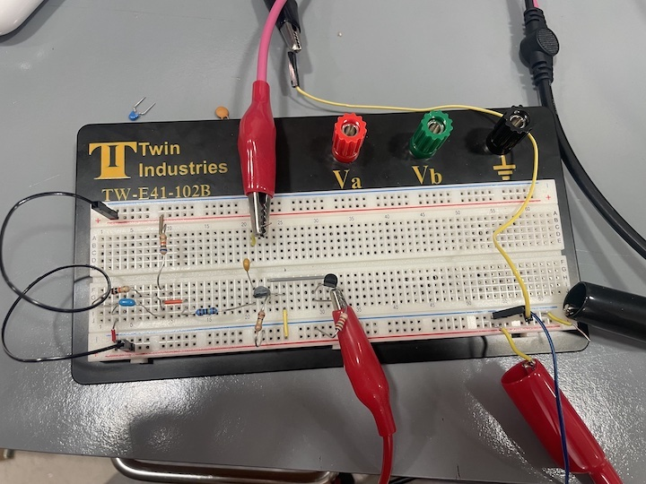
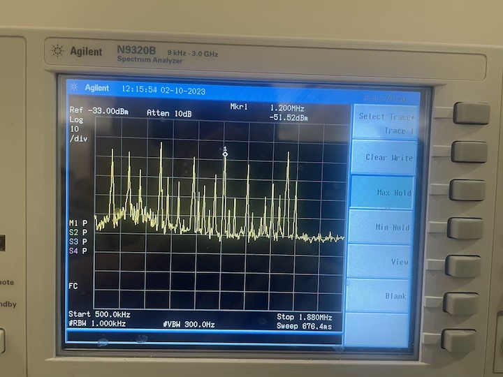

# Hardware report

## Active Antenna

The following figure illustrates the schematic active antenna circuit, powered up by a 3.3V DC source. The circuit consists of two stages. The first stage utilizes a BF256B JFET emitter follower with a voltage divider at the base to regulate the voltage at Output1 and prevent the JFET from saturating. The second stage of the circuit is a PN2222A BJT emitter follower to achieve a low output impedance. Since the spectrum analyzer only has a low input impedance of 50 ohms, a large output impedance is added between the circuit and spectrum analyzer during signal analysis to prevent damage to the spectrum analyzer.

As the bode plot of the output shown, the active antenna circuit will not amplify any signals. Instead, it will allow the signal in the range of 1kHz to 2MHz to pass through and attenuate the rest signals. This circuit is particularly useful for AM radio which covers frequencies ranging from 500kHz to 1.8MHz. 

The following figure displays the prototype of the active antenna on a breadboard. By replacing the input with a 15 feet 28 gauge wire, the active antenna is able to collect the surrounding AM signals. Fig4 shows the output of the active antenna on the spectrum analyzer, revealing the presence of AM radio signals in the Boston University Photonics Center Room 113. The room contains multiple AM radios, as indicated by the distinct peaks on the graph, notably at 850kHz, 1.03MHz, 1.32MHz, and 1.55MHz. The graph serves as evidence that the AM radio signals are capable of penetrating through the walls and being collected by the active antenna.

