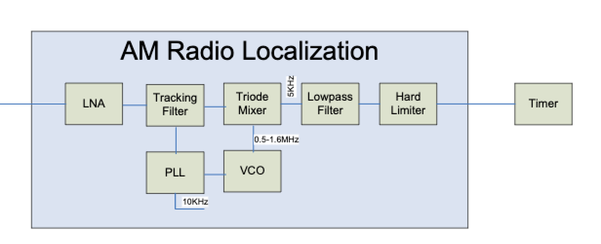
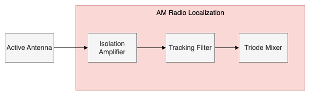

# EC464_Team15_Betterbot

The overall objective of this project is to implement and improve the existing AM Radio Localization subsystem shown in figure. The AM Radio is composed of seven different components. Low noise amplifier (LNA) that will amplify signals coming from the active antenna while degrading the signal-to-noise ratio. Tracking filter is a bandpass filter that will pass only a narrow range of signals coming from LNA according to the AM station. Phase locked loop (PPL) along with voltage control oscillator (VCO) will generate an oscillator from 0.5MHz - 1.6MHz with a step of 10KHz from the computer. A triode mixer produces an intermediate frequency signal by multiplying a radio frequency with a local oscillator frequency signal. Lowpass filter removes all the unwanted noise of the intermediate frequency. The last part is a hard limiter that will transform all the signals into a square waveform of 1.8V for the FPGA to measure. 

	
In the designing process of AM Radio Localization subsystem, PLL and VCO need to generate an oscillator signal from 0.5 MHz to 1.5 MHz with a step of at least 10 KHz and be able to adjust by computer control. Another requirement is that The mixer is what produces the 5KHz signal.  Q-enhancement is used for the tracking filter and VCO. Q-enhancement takes positive feedback. We have to be careful with the level of positive feedback in order to not turn it into an oscillator. 
Another goal is to limit the space of the AM Radio Localization circuits to a maximum of 3 square inches of a double-sided, 4-layer PCB will significantly help us to reduce the capacity. The final product will be designed with mostly discrete circuitry and open-source hardware design. Lastly, the AM Radio Localization should be comparable or higher quality than the current marketing AM Radio designs.
	
Due to time limitation, we only have time to validate and improve three parts of the modules-isolaton amplifier, tracking filter, and triode mixer- along with our self designed active antenna since the robot already has another complex system for collecting surrounding AM signals. The overall modules of what we have working on is shown in the following figure:

